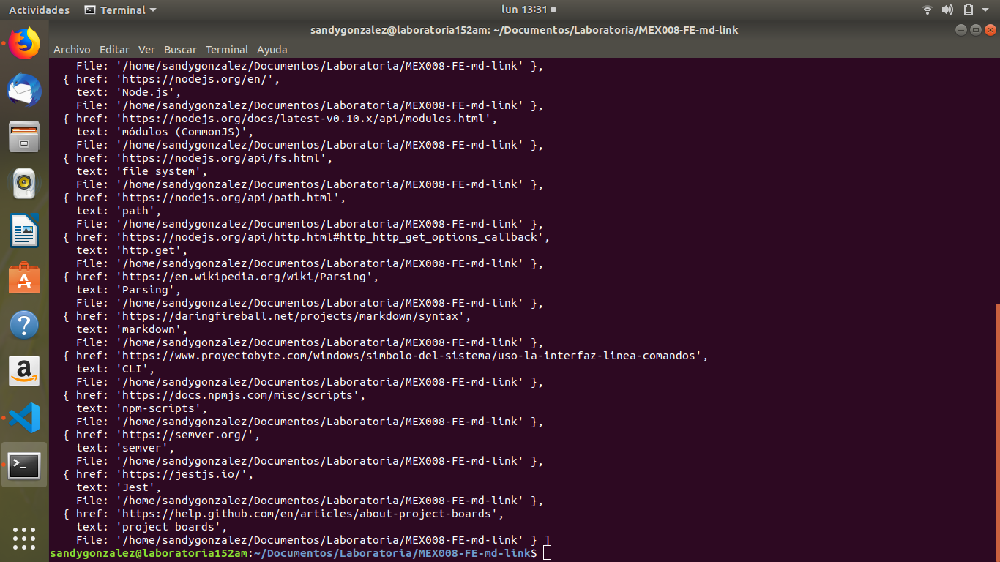

# mdlinks-sandy
[link presentacion](https://www.canva.com/design/DADlAk6_xZw/ToQPW78nTutO04x_gxf_tw/view?utm_content=DADlAk6_xZw&utm_campaign=designshare&utm_medium=link&utm_source=publishsharelink)

***

## 1. Preámbulo

[Markdown](https://es.wikipedia.org/wiki/Markdown) es un lenguaje de marcado
ligero muy popular entre developers. Es usado en muchísimas plataformas que
manejan texto plano (GitHub, foros, blogs, ...), y es muy común
encontrar varios archivos en ese formato en cualquier tipo de repositorio
(empezando por el tradicional `README.md`).

Estos archivos `Markdown` normalmente contienen _links_ (vínculos/ligas) que
muchas veces están rotos o ya no son válidos y eso perjudica mucho el valor de
la información que se quiere compartir.

Dentro de una comunidad de código abierto, nos han propuesto crear una
herramienta usando [Node.js](https://nodejs.org/), que lea y analice archivos
en formato `Markdown`, para verificar los links que contengan y reportar
algunas estadísticas.

## 2. Resumen del proyecto

[Node.js](https://nodejs.org/es/) es un entorno de ejecución para JavaScript
construido con el [motor de JavaScript V8 de Chrome](https://developers.google.com/v8/).
Esto nos va a permitir ejecutar JavaScript en el entorno del sistema operativo,
ya sea tu máquina o un servidor, lo cual nos abre las puertas para poder
interactuar con el sistema en sí, archivos, redes, ...

En este proyecto nos alejamos un poco del navegador para construir un programa
que se ejecute usando Node.js, donde aprenderemos sobre cómo interactuar con el
sistema archivos, con el entorno (_proceso_, _env_, _stdin/stdout/stderr_), ...

## 3. Objetivos de aprendizaje

El objetivo práctico de este proyecto es que aprendas cómo crear tu propia
**librería** (o biblioteca - _library_) en JavaScript.

Diseñar tu propia librería es una experiencia fundamental para cualquier
desarrollador porque que te obliga a pensar en la interfaz (API) de tus
_módulos_ y cómo será usado por otros developers. Debes tener especial
consideración en peculiaridades del lenguaje, convenciones y buenas prácticas.

Tópicos:

- [Node.js](https://nodejs.org/en/).
- [módulos (CommonJS)](https://nodejs.org/docs/latest-v0.10.x/api/modules.html).
- [file system](https://nodejs.org/api/fs.html).
- [path](https://nodejs.org/api/path.html).
- [http.get](https://nodejs.org/api/http.html#http_http_get_options_callback).
- [Parsing](https://en.wikipedia.org/wiki/Parsing).
- [markdown](https://daringfireball.net/projects/markdown/syntax).
- [CLI](https://www.proyectobyte.com/windows/simbolo-del-sistema/uso-la-interfaz-linea-comandos).
- [npm-scripts](https://docs.npmjs.com/misc/scripts).
- [semver](https://semver.org/).

## 4. Consideraciones generales

Este proyecto se debe "resolver" de manera individual.

La librería debe estar implementada en JavaScript para ser ejecutada con
Node.js. **Está permitido usar librerías externas**.

## 5. Criterios de aceptación mínimos del proyecto

Tu módulo debe ser instalable via `npm install <github-user>/md-links`. Este
módulo debe incluir tanto un _ejecutable_ que podamos invocar en la línea de
comando como una interfaz que podamos importar con `require` para usarlo
programáticamente.

Los tests unitarios deben cubrir un mínimo del 70% de _statements_, _functions_,
_lines_ y _branches_. Te recomendamos explorar [Jest](https://jestjs.io/)
para tus pruebas unitarias.

Para comenzar este proyecto tendrás que hacer un _fork_ y _clonar_ este
repositorio.

Antes de comenzar a codear, es necesario crear un plan de acción. Esto debería
quedar detallado en el `README.md` de tu repo y en una serie de _issues_
y _milestones_ para priorizar y organizar el trabajo, y para poder hacer
seguimiento de tu progreso.

Dentro de cada _milestone_ se crearán y asignarán los _issues_ que cada quien
considere necesarios.

También te sugerimos que empieces a utilizar los [project boards](https://help.github.com/en/articles/about-project-boards) de github que te
ayudaran a organizar y priorizar su trabajo.

### Archivos del proyecto

* `README.md` con descripción del módulo, instrucciones de instalación/uso,
  documentación del API y ejemplos. Todo lo relevante para que cualquier
  developer que quiera usar tu librería pueda hacerlo sin inconvenientes.
* `index.js`: Desde este archivo debes exportar una función (`mdLinks`).
* `package.json` con nombre, versión, descripción, autores, licencia,
  dependencias, scripts (pretest, test, ...)
* `.editorconfig` con configuración para editores de texto. Este archivo no se
  debe cambiar.
* `.eslintrc` con configuración para linter. Este archivo no
  se debe cambiar.
* `.gitignore` para ignorar `node_modules` u otras carpetas que no deban
  incluirse en control de versiones (`git`).
* `test/md-links.spec.js` debe contener los tests unitarios para la función
  `mdLinks()`. Tu inplementación debe pasar estos tets.

### JavaScript API

El módulo debe poder importarse en otros scripts de Node.js y debe ofrecer la
siguiente interfaz:

#### `mdLinks(path, options)`

##### Argumentos

* `path`: Ruta absoluta o relativa al archivo o directorio. Si la ruta pasada es
  relativa, debe resolverse como relativa al directorio desde donde se invoca
  node - _current working directory_).
* `options`: Un objeto con las siguientes propiedades:
  - `validate`: Booleano que determina si se desea validar los links
    encontrados.
